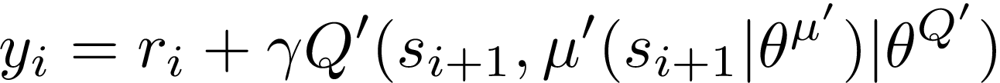

#### Overview

this project was solved using pytoch framework, which is a powerfull tool for deep learning development.Using the DDPG algorith, the environment was solved in 64 episodes with a score of +30.

#### Learing Algorithm

For the solution of this projects, it was applied the DDPG (Deep Deterministic Policy Gradient) algorithm, which is very suitable for continuous spaces. This algorithm uses two similar neural network, one for the Actor and another for the Critic model. 

In the DDPG, the Actor model is trained to represent the polyce itself, in wich is responsable to map states to the best possible actions. It is used to appoximate the optimal policy deterministically. The Critic model, on the other hand, works to learn to evaluate the the pair (state, action) predicted by the Actor. That's mean that the both input and output of the actor are used by the critc model, in which the action is the target value.

Since, neural networks as classified as supervised learning, we need the target data in order to train these models. So, the target Q values are computed using the bellman equation:

There are two copies of each networks, one for the actor and another for the actor. These copies are the regular/online networks and the other is the target network. In each steps the target networks are slighted updated by the online network with a small percetange of their weights and this is called a soft update strategy.

These nework have three full connected layers with relu as activation function at the hidden layer and a tanh in the output layer.

In DDPG, it used a buffer with store a bunch of steps responses (state, action, reward, next_state, done), which are sampled randomly by the Actor model to avoid correlation between them during the model training. This buffer ensure the model are being trained using data that are independents of each other.

Inproviments in the explocation is done by adding some noise to the action. for this purpose it was used the Ornstein-Uhlenbeck Process, which has been proved to improve the action exploration according to this 
[ddpg papper](https://arxiv.org/pdf/1509.02971.pdf)

The archtecture of the projec counts with a agent class that uses these to solve the environmet.
The main parans used is described bellow:
* the max number of episodes was setted to 1000
* within each episode, it was allowed to try only 1000 steps at the most
* discount rate to the improviment of the polyce: 0.99
* Reply buffer for a random selection of episode with size 10^6. The seelction batch in this buffer was 128
* Both neuron nets for Actor and Critic models have 256 neurons in the hiddne layers
* The MSE loss function was used to optimize the models.

The result of training can be seen bellow

See the graph of scores x episodes

See the same same data above, now in a smorthed graph

#### critic points

The main iproviments observed came in the neuro net models when it was consideres grow the number of neurons in the hidden layers and mostly importan, when it was included a batch normalization between the hidden layers.

For more details about continous control with DDPG algorithm, read this [papper](https://arxiv.org/pdf/1509.02971.pdf)

#### Further works

As improviments of this implementation, it is convenient introduce some convolutional layers such as Conv1d and Conv2d and observe what results the training will have.

Another point is explore some ways to initialize the weights of the models. Maybe a normal distribution could lead to interesting results at the end of thaining. 

Although the neuro nets used in this implementation has generalized well the learning process, there are some adtional improviments that could be inplemented, such as dropout in the hidden layers and a reularization functions. These method are good strategies to avoid overfitting and will keep the weights of the models low, making them simple and capable to generalize well the sapce into the actions.

Finally, it is notible the quantity of hyperparams this algorithm requires, which encourages us to try a sistematic way to find the best fit to all of them. this cold be reach by using a grid searh are eve, a stocastic optimization method, such as PSO or genetic algorithm. Of course, it will be strong computational demmanding but can bring some interesting results.
